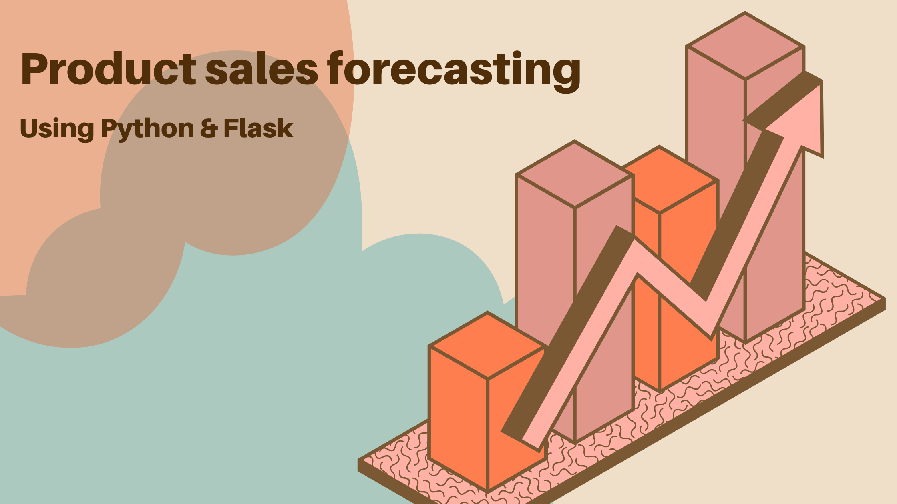
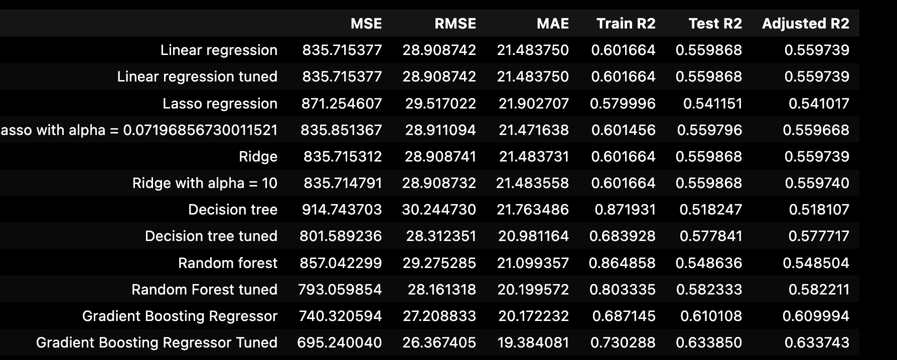

# Sales Prediction Using Python

Click on the following links to checkout the colab file & video presentation.
- [Article](https://medium.com/p/87d2efd85da7)
- [Video](https://drive.google.com/file/d/1v1dNz0WB5ykNDCO4PsN2xP272mWv3Q25/view?usp=sharing)

---

## Problem Statement

The problem at hand involves predicting future sales for product. Effective sales forecasting is fundamental for multiple aspects of retail management and operation, including:

    Inventory Management: Accurate sales forecasts help ensure that stores maintain optimal inventory levels—enough to meet customer demand without overstocking, which can lead to increased costs or waste, especially in the case of perishable goods. 

    Financial Planning: Forecasting sales allows businesses to estimate future revenue and manage budgets more effectively. This is crucial for allocating resources to areas such as marketing, staffing, and capital investments.

    Marketing and Promotions: Understanding when sales peaks and troughs are likely to occur enables retailers to plan effective marketing campaigns and promotional offers to boost revenue or manage customer flow.

    Supply Chain Optimization: Sales forecasts inform production schedules, logistics, and distribution plans, ensuring that products are available where and when they are needed, thereby reducing transportation and storage costs.

    Strategic Decision Making: Long-term sales forecasting supports broader business strategies, including store expansions, market entry, and other capital expenditures.

**Challenges:**

1. Data-Related Challenges:  Limited or insufficient past data may not provide enough patterns for accurate forecasting.
2. External Factors Affecting Sales: Unexpected events/ Economic factors
3. Model-Related Challenges: Deciding between statistical models (ARIMA, exponential smoothing) and machine learning models

**Objective:**

Develop a machine learning model using Python to predict future sales. Then  Deployment via Flask API.

**Importance:**

Accurate sales predictions empower businesses to optimize their advertising strategies, allocate resources efficiently, and adapt to changing market dynamics effectively.

**Approach:**

The project will utilize Python's machine learning capabilities, employing regression analysis and predictive modeling techniques to create a robust sales prediction model.

**Outcome:**

The successful execution of this project will result in a reliable tool for businesses, enabling them to make informed decisions, enhance marketing strategies, and achieve better sales forecasting accuracy.

---

## Project Summary

**Objective:**

In this data science project, the goal is to predict future sales for product and service-based businesses. The prediction factors include Data-Related Challenges, External Factors Affecting Sales, and adapt to changing market dynamics effectively.

**Scope:**

Sales prediction is a critical tool for businesses, aiding in decision-making related to advertising costs and strategies. The project employs Python for machine learning to forecast future sales.

**Key Components:**

Demand Planning : Helping inventory management teams stock the right products.
Pricing Strategy : Adjusting prices based on predicted demand.
Marketing & Promotions : Timing promotions to maximize sales impact.

**Implementation:**

Python will be the primary tool for implementing machine learning models. Techniques such as regression analysis and predictive modeling will be employed.

**Outcome:**

The project aims to deliver a robust sales prediction model, enabling businesses to make data-driven decisions, optimize advertising strategies, and enhance operational efficiency.

---

## Results

I have selected r2 score as the primary evaluation metric for the Sales Prediction model. The final list:

## Conclusion

In the dynamic landscape of product and service-based businesses, the ability to forecast sales is paramount. This project, delved into the realm of sales prediction using machine learning with Python. Let's encapsulate the key findings:

**Insights and Observations:**

1. Sales exhibit a statistically significant increase in sales on discount days compared to non-discount days. 
2. Notably, there's a strong correlation between orders and sales.
3. The R2 score, chosen as the evaluation metric, showcased the accuracy of the model in predicting sales.
4. The Gradient Boosting model emerged as the preferred choice, achieving 73% training accuracy and 63% testing accuracy.

**Key Takeaways:**

- Understanding the correlation between orders and sales with respect to discount and holidays aids in strategic decision-making.
- The selected model demonstrates robust predictive capabilities, laying the groundwork for effective sales planning.
- The R2 score provides a reliable indicator of the model's accuracy in forecasting sales trends.

This project not only addresses the nuances of sales prediction but also highlights the pivotal role of data science in optimizing business strategies. The findings contribute to informed decision-making, offering valuable insights for future sales initiatives.

---

## Author

- [Lavanya Mullachery](https://www.linkedin.com/in/lavanya-mullachery/)

